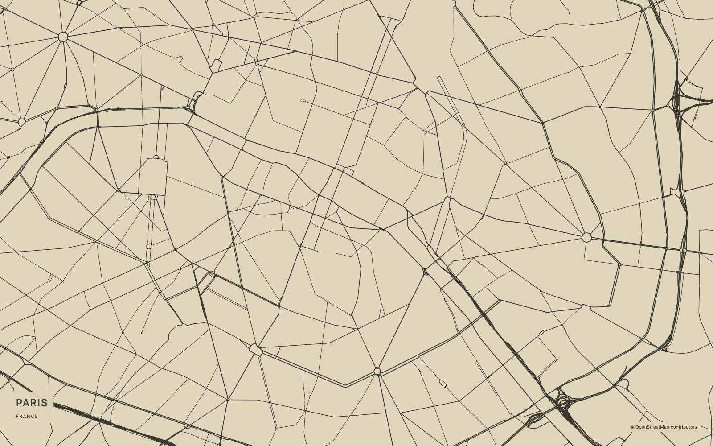
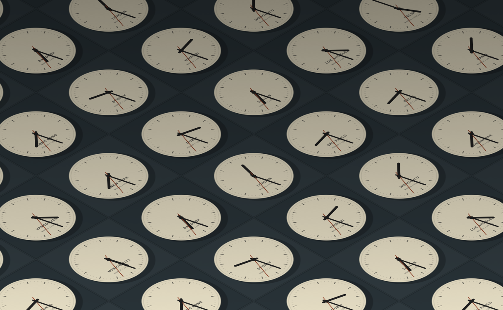
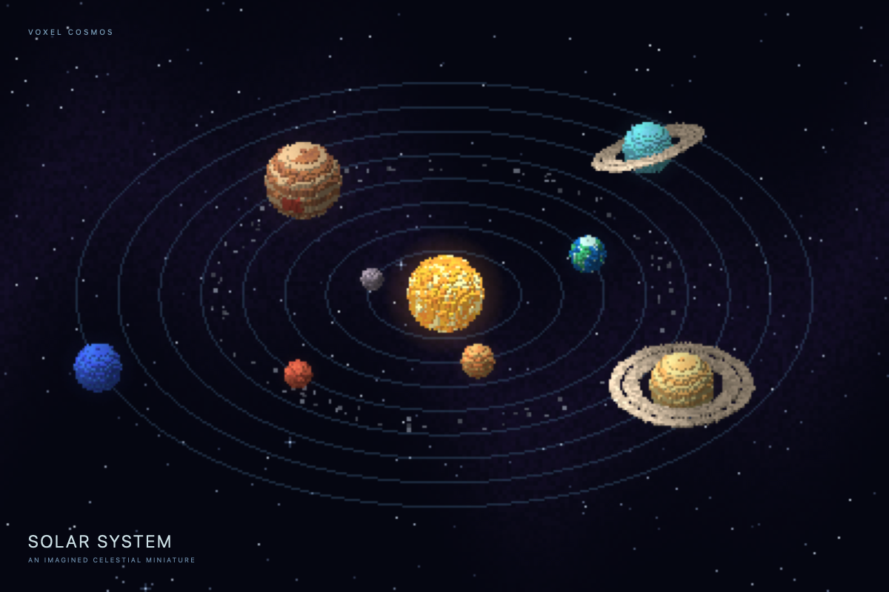
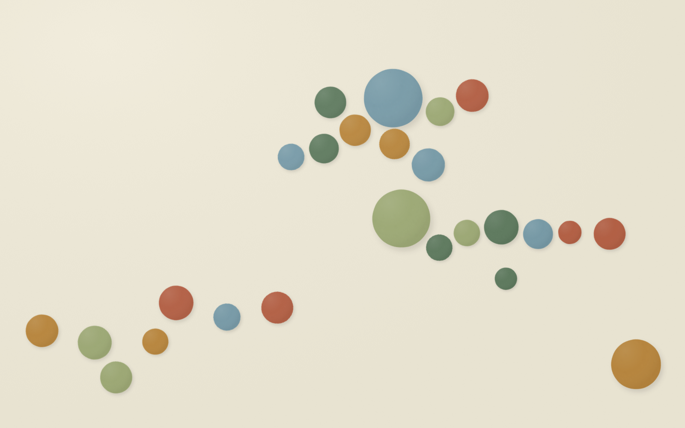
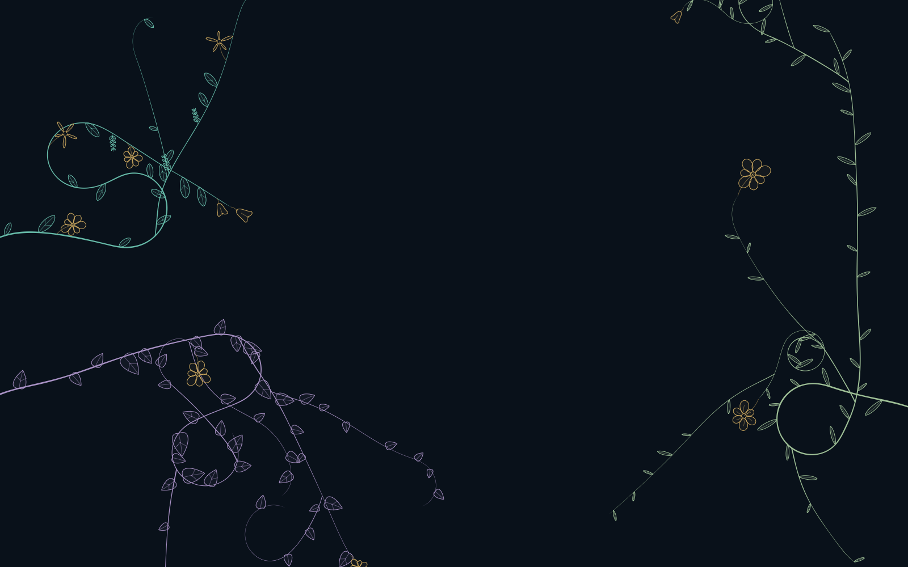
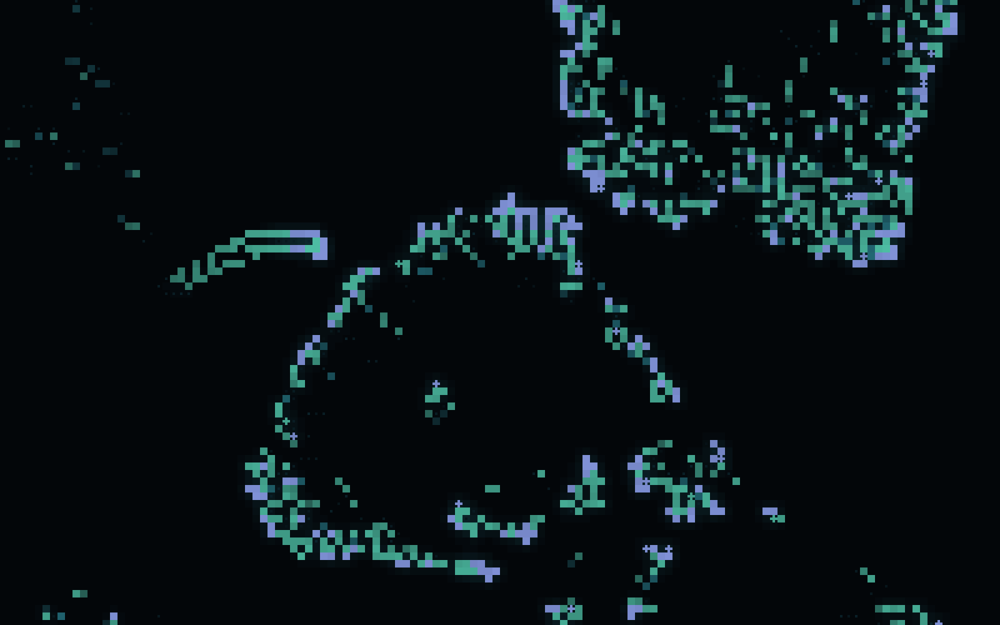
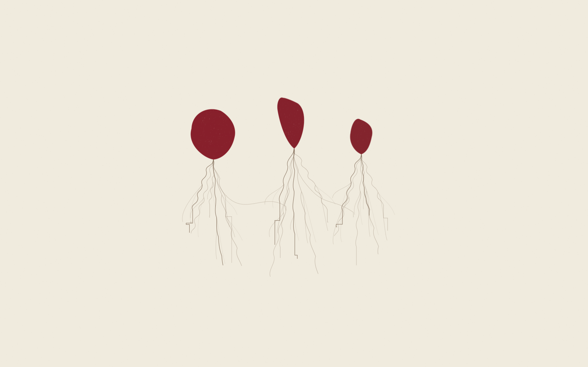
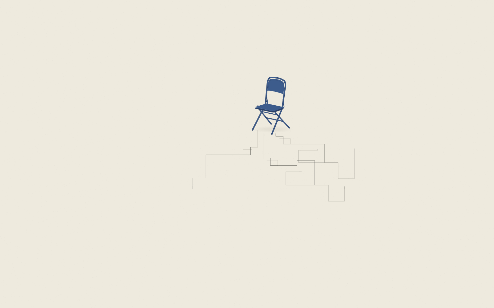

# Screensavers for Mac

Native macOS screen savers that turn idle displays into imaginative, ever-changing worlds.
Built with Swift, AppKit, Core Graphics, and Core Animation. No browser runtime or dependencies.

**[Download latest release](https://github.com/someone-in-texas/screensavers-for-mac/releases/latest)** · Apple Silicon · macOS 14.6 or later

## City Drift

Drift through the street patterns of 64 cities, drawn as crisp online vector maps.
Choose six palettes and independently show street labels, water, parks, and points
of interest. A new city arrives about every two minutes. No API key required.

Bundled Paris, Boston, and Tokyo maps provide an immediate opening and an offline
fallback. Traditional OpenStreetMap imagery is also available. Select **Line map ·
3 cities · Offline** for a completely offline experience.



[More map styles](docs/images/city-drift-online.png) · [Map sources and caching](docs/MAPS_AND_PERFORMANCE.md).
Map data and imagery © [OpenStreetMap contributors](https://www.openstreetmap.org/copyright).

## World Clock Room

An isometric installation of ivory clocks on a charcoal floor. Twenty cities keep
real local time, with smooth hands, subtle shadows, and a slowly drifting camera.
Change the floor and clock colors, density, motion, second hands, and labels.



## Voxel Cosmos

A pixel-lit solar system made of tiny shaded cubes. Tour all eight planets, Saturn’s
rings, an asteroid belt, and deep space with varied compositions and soft crossfades.

Choose from 14 views, four camera modes, and Nebula, Aurora, Stars, or Black void
backgrounds. Adjust motion, pixel size, glow, and star density. Entirely procedural
and offline; sizes and distances are artistic rather than scientific.



[Saturn closeup](docs/images/voxel-cosmos-saturn.png)

## Paper Sky

An endless paper-airplane flight above sculpted clouds and synthwave sunsets.
Individually folded wings catch warm light as companions join and peel away.
The camera eases between isometric, third-person, and side-on views.

Choose a viewpoint or the changing-camera journey; select four sunset palettes or
evolving colors. Adjust flight speed, cloud cover, view duration, and glow; toggle
companions, vapor trails, and the striped sun. Procedural, crisp at every size, and entirely offline.


## Dapple

A little kinetic artwork: textured paper circles coast over invisible hills, nudge
each other, and occasionally make a playful hop. Warm pigment, fine fibers, and
soft shadows give each shape a tactile presence, with room for the eye to rest.

Choose Hills, Float, Playground, or Zen; eight curated palettes and four materials
change the mood from warm printed paper to an after-dark garden. Adjust size,
population, speed, texture, shadows, and occasional events. Start a fresh composition
each launch, repeat a daily scene, or keep a favorite seed. Entirely procedural and offline.



[Night Garden](docs/images/dapple-night.png)

## Flourish

A botanical drawing that grows across the screen: tapered ink stems curl into
leaves, ferns, bells, and delicate blossoms, leaving generous open space. Each
composition develops over several minutes, rests, then gently gives way to another.

Choose five growth styles, eight palettes, three pen characters, paper or clean
backgrounds, a faint pigment wash, and optional breeze. Adjust growth, density,
leaves, and flowers; save a seed or let each day bring something new. Entirely offline.



[Porcelain](docs/images/flourish-porcelain.png)

## Lattice

A small luminous ecosystem. Pixel colonies branch, drift, pulse, and fall dormant
while new life finds its way into the dark. Crisp cores sit above a restrained glow;
local events keep the world changing without an abrupt full-screen reset.

Four rule families—Bloom, Drift, Reef, and Signal—pair with eight palettes and
controls for activity, speed, pixel size, glow, trails, and events. Fresh, daily,
and fixed seeds make each world spontaneous or repeatable. Entirely offline.



[Amber Terminal](docs/images/lattice-amber.png)

## Strawberry Fields Forever

Three procedurally shaped strawberries hang in a quiet field of paper, with
uneven leafy crowns and dark, scattered seeds. Fine roots grow downward into
angular circuit traces and tiny terminals. All three begin with bare roots.
Connected branches extend, fade and grow new paths in independent cycles while
the print gently drifts across the field, continuing through long sessions.

Choose six restrained palettes, five compositions, root-to-circuit balance,
paper/vellum/canvas surfaces, and gentle growth, breathing or signal motion.
Fresh, daily and fixed seeds make each print repeatable. Entirely offline.



[Museum Night](docs/images/strawberry-night.png) · [Root study](docs/images/strawberry-transition.png)

## Good Research Takes Time

A solitary blue metal folding chair anchors an unfinished architectural drawing.
Graphite routes open into chambers, turn back, and gradually find new edges across a warm
ivory field. Connected branches grow, fade and renew their architecture independently; the chair
changes orientation between quiet rests as the whole drawing gently drifts.

Five quiet palettes, five drawing styles, four line characters, and open or denser
compositions. Choose a still chair, occasional turns, or a very slow change of angle;
save a seed or let each day bring a new drawing. Entirely offline and silent.



[Charcoal study](docs/images/research-chair.png) · [Blueprint study](docs/images/research-archive.png)

## Install

1. Download the **DMG** from [Releases](https://github.com/someone-in-texas/screensavers-for-mac/releases).
2. Open it and double-click each `.saver`. Choose installation for the current user.
3. Open **System Settings → Wallpaper → Screen Saver** (or **Screen Saver** on older
   macOS). Under **Other → Show All**, select a saver and open **Options / Screen Saver Options**.

The ZIP contains the same nine bundles. To verify downloads, place the DMG, ZIP,
and `SHA256SUMS` in one directory and run `shasum -a 256 -c SHA256SUMS` there.

Releases without Apple signing credentials are **ad-hoc signed, not notarized**.
If macOS blocks a downloaded saver, verify its source and checksum, then use
**System Settings → Privacy & Security → Open Anyway** for that item if offered.
See [Troubleshooting](docs/TROUBLESHOOTING.md) for picker thumbnails and refreshing an installed saver.

To remove a saver, delete its bundle from `~/Library/Screen Savers/`, or run
`make uninstall`. Preferences and cached maps are retained.

## Build and preview

Use current Xcode or Apple’s Command Line Tools on an Apple Silicon Mac.

```sh
git clone https://github.com/someone-in-texas/screensavers-for-mac.git
cd screensavers-for-mac
make build       # nine .saver bundles and PreviewHost.app in build/products
make test        # deterministic offline tests, bundle loading, and renderer checks
make preview     # switch savers, configure, resize, or save a frame
open build/products/PreviewHost.app --args --dapple
make install     # rebuild and install for the current user
make package     # DMG, ZIP, and SHA256SUMS in dist
```

Quit PreviewHost before rebuilding. After reinstalling, quit and reopen System
Settings so it can load the updated bundles.

## Privacy and power

Strawberry Fields Forever, Good Research Takes Time, Flourish, Lattice, Dapple, Paper Sky,
Voxel Cosmos, and World Clock Room are entirely offline.
City Drift’s online modes request OpenStreetMap tiles for the selected public city,
never your location; offline mode makes no requests. No analytics, telemetry,
location permission, updater, or configuration upload.

Strawberry Fields Forever, Good Research Takes Time, Flourish, Lattice, Dapple, World Clock Room,
and Voxel Cosmos target 30 FPS; City Drift and Paper Sky
target 60 FPS. Geometry, textures, and map tiles are cached. See
[map policies and rendering details](docs/MAPS_AND_PERFORMANCE.md).

## Contribute

[Contributing](CONTRIBUTING.md) · [Architecture](docs/ARCHITECTURE.md) ·
[Add a saver](docs/ADDING_A_SCREENSAVER.md) · [Releasing](docs/RELEASING.md) ·
[Validation](docs/VALIDATION.md)

Report map issues at [OpenStreetMap](https://www.openstreetmap.org/fixthemap), and
project bugs through [GitHub Issues](https://github.com/someone-in-texas/screensavers-for-mac/issues).

Code: [MIT](LICENSE). Map data and imagery: [Third-party notices](THIRD_PARTY_NOTICES.md).

## Agents and personal screen savers

Use [AGENTS.md](AGENTS.md), the [reusable skills](SKILLS.md), and the
[agent development guide](docs/AGENT_DEVELOPMENT.md) to contribute efficiently or
create your own standalone saver with `Scripts/new-saver.py`. Personal projects
need not be contributed back. The [optional AI helper](docs/AI_HELPER.md) provides
ChatGPT sign-in and content testing for future AI savers; none of today's nine
savers uses or requires it.
